# 🎬 DARKAI Studio — Suíte Autônoma de Produção Audiovisual

<p align="center">
  
  
  
  
  
  
  
  
</p>

O **DARKAI Studio** é uma plataforma completa e autônoma de produção audiovisual desenvolvida para criadores de conteúdo do YouTube, TikTok e Instagram Reels. 

O sistema é dividido em **dois grandes módulos de produção**:

1. 📽️ **Módulo VÍDEOS LONGOS (Canal Dark 16:9)**: Automação completa para documentários, mistérios e canais sem rosto (roteiro cinematográfico, narração ElevenLabs/voz própria, sincronização Whisper local, imagens IA com consistência visual, animação Ken Burns, legendas dinâmicas e publicação automática no YouTube).
2. ⚡ **Módulo VÍDEOS CURTOS (Flow & Multi-Nicho 9:16)**: Esteira ágil inspirada no método viral do [Google Flow](https://labs.google/flow) para criação em **qualquer nicho ou gênero** (humor nonsense, animais, fábulas, curiosidades, pessoas). O DARKAI gera o roteiro com **Hook inicial (0-3s)**, as fichas de **Imagens Âncora (9:16)** e os **Prompts de Animação com Diálogos** para o Flow, e em seguida realiza a **junção automatizada** dos clipes com normalização de áudio, transições dinâmicas e efeitos sonoros (SFX).

---

## 📑 Sumário

- [Visão Geral dos Módulos](#-visão-geral-dos-módulos)
- [Arquitetura dos Módulos](#-arquitetura-dos-módulos)
- [Pré-requisitos](#-pré-requisitos)
- [Instalação e Configuração](#-instalação-e-configuração)
- [Como Executar](#-como-executar)
- [Guia de Uso: Módulo Vídeos Curtos (Flow)](#-guia-de-uso-módulo-vídeos-curtos-flow)
- [Guia de Uso: Módulo Vídeos Longos (Canal Dark)](#-guia-de-uso-módulo-vídeos-longos-canal-dark)
- [Estrutura do Projeto](#-estrutura-do-projeto)
- [Variáveis de Ambiente (.env)](#-variáveis-de-ambiente-env)
- [Contribuição](#-contribuição)
- [Licença](#-licença)

---

## 🧭 Visão Geral dos Módulos

| Recurso | 📽️ Módulo VÍDEOS LONGOS | ⚡ Módulo VÍDEOS CURTOS |
|---|---|---|
| **Foco de Plataforma** | YouTube (Formato Horizontal 16:9) | TikTok, YouTube Shorts, Reels (Vertical 9:16) |
| **Nichos Suportados** | Conspirações, Mistérios, Arquivos Históricos | **Qualquer nicho** (Humor, Animais, Curiosidades, Fábulas, etc.) |
| **Motor de Roteiro** | Google Gemini 2.5 Flash (Estrutura em Atos) | Google Gemini 2.5 Flash (Hook 0-3s + Cenas Rápidas) |
| **Geração Visual** | Imagens Estáticas + Bíblia Visual (5 Estilos) | **Imagens Âncora 9:16** + Prompts de Animação para o Flow |
| **Voz e Áudio** | ElevenLabs / Clonagem / Gravação Própria | Diálogos e falas integrados via **Image-to-Video no Flow** |
| **Edição e Montagem** | MoviePy 2.x + Ken Burns + Legendas Karaokê | **Assembler Automático**: Junção sequencial + Transições + SFX |
| **Publicação** | YouTube Data API v3 (OAuth 2.0) | Exportação MP4 direta pronta para redes sociais |

---

## 📐 Arquitetura dos Módulos

```mermaid
flowchart TD
    subgraph MODULO_CURTOS["⚡ MÓDULO VÍDEOS CURTOS (Flow & Multi-Nicho 9:16)"]
        C1[Briefing: Qualquer Tema ou Gênero] --> C2[Gemini: Roteiro com Hook 0-3s]
        C2 --> C3[Fichas de Personagens Âncora 9:16]
        C2 --> C4[Prompts de Imagem 9:16 & Animação Image-to-Video]
        C3 & C4 -->|Usuário gera no Flow| C5[Google Flow / Nano Banana 2]
        C5 -->|Clipes Animados MP4| C6[Shorts Assembler Automático]
        C6 -->|Transições + SFX Whoosh + Ganho de Áudio| C7[Vídeo Final 9:16 Pronto!]
    end

    subgraph MODULO_LONGOS["📽️ MÓDULO VÍDEOS LONGOS (Canal Dark 16:9)"]
        L1[Radar de Nichos / Pauta Dark] --> L2[Gemini: Roteiro Longo em Atos]
        L2 --> L3[ElevenLabs / Áudio Próprio]
        L3 --> L4[OpenAI Whisper Local: Timestamps]
        L2 --> L5[Bíblia Visual & Imagens IA]
        L4 & L5 --> L6[Editor MoviePy: Ken Burns + Legendas Karaokê]
        L6 --> L7[Vídeo Final 16:9 + Thumbnails + YouTube API]
    end
```



---

## 💻 Pré-requisitos

- **Sistema Operacional**: Windows 10/11, Linux ou macOS.
- **Python**: Versão **3.10**, **3.11** ou **3.12** (Recomendado: Python 3.12).
- **FFmpeg**: O pacote `imageio-ffmpeg` supre o executável interno, mas ter o FFmpeg no sistema é altamente recomendado.
- **Chaves de API**:
  - [Google AI Studio](https://aistudio.google.com/) — Para a API do Gemini (roteiros, ganchos e prompts).
  - [ElevenLabs](https://elevenlabs.io/) — Para o módulo longo de narração (se usar síntese de voz por IA).
  - [Google Cloud Console](https://console.cloud.google.com/) — Arquivo `client_secrets.json` para uploads diretos no YouTube (opcional).

---

## 🚀 Instalação e Configuração

### 1. Clonar o Repositório

```bash
git clone https://github.com/thiagoLopesAlvim/DARKAI.git
cd DARKAI
```

### 2. Criar e Ativar o Ambiente Virtual

#### Com `uv` (Recomendado — Ultra Rápido):
```bash
uv venv --python 3.12 .venv
.venv\Scripts\activate      # No Windows
# source .venv/bin/activate # No Linux/macOS
uv pip install -r requirements.txt
```

#### Com Python padrão (`venv` + `pip`):
```bash
python -m venv .venv
.venv\Scripts\activate      # No Windows
# source .venv/bin/activate # No Linux/macOS
pip install -r requirements.txt
```

### 3. Configurar as Variáveis de Ambiente

Copie o `.env.example` para `.env` e configure sua chave do Google Gemini:

```env
# Google Gemini API
GEMINI_API_KEY=sua_chave_gemini_aqui
GEMINI_MODEL=gemini-2.5-flash

# ElevenLabs API (Obrigatória apenas para narração no módulo de vídeos longos)
ELEVENLABS_API_KEY=sua_chave_elevenlabs_aqui
ELEVENLABS_VOICE_ID=pNInz6obpgDQGcFmaJgB
```

---

## 🖥️ Como Executar

Inicie o painel web no seu navegador:

```bash
streamlit run interface.py
```

Ou usando o executável do ambiente virtual:
```powershell
.venv\Scripts\streamlit.exe run interface.py
```

Acesse no navegador: 👉 **`http://localhost:8501`**

Na **barra lateral**, você pode alternar livremente entre os dois modos de produção:
- ⚡ **VÍDEOS CURTOS (Flow & Multi-Nicho 9:16)**
- 📽️ **VÍDEOS LONGOS (Canal Dark 16:9)**

---

## ⚡ Guia de Uso: Módulo Vídeos Curtos (Flow)

Este módulo foi desenhado especificamente para a esteira rápida ensinada no vídeo tutorial de R$10K/Mês com IA:

### 1. Aba "💡 1. Roteiro & Prompts Flow"
- **Escolha o Gênero**: *Humor & Nonsense*, *Animais com Atitude*, *Gancho Direto*, *Curiosidade Chocante*, *Fábulas Rápidas* ou *Personalizado*.
- **Defina o Tema**: Digite qualquer ideia criativa (ex: *"Um gato persa mafioso cobrando o aluguel de um cachorro salsicha..."*).
- **Clique em "Gerar Roteiro Viral"**:
  - O sistema gera um **Hook de Retenção imediato (0 a 3s)**.
  - Exibe fichas das **Imagens Âncora** com os prompts de personagens isolados em 9:16.
  - Para cada cena, fornece o **Prompt de Imagem Base 9:16** e o **Prompt de Animação (Image-to-Video) com Diálogo** pronto para colar no [Google Flow](https://labs.google/flow).

### 2. No Google Flow
- Gere as imagens de cada cena na proporção **9:16**.
- Cole o prompt de animação e o diálogo na aba **Image-to-Video** e gere os clipes animados com som.
- Baixe os arquivos MP4 gerados (`cena_1.mp4`, `cena_2.mp4`...).

### 3. Aba "🎬 2. Junção de Clipes (Assembler)"
- **Importe os Clipes**: Faça upload dos vídeos baixados ou aponte uma pasta local. O DARKAI os organiza automaticamente em ordem numérica.
- **Ajuste os Parâmetros**:
  - Transição: *Crossfade suave*, *Slide lateral (estilo CapCut)* ou *Corte seco*.
  - Efeito Sonoro (SFX): *Whoosh*, *Swoosh*, *Punch* ou *Nenhum*.
  - Ganho de áudio das vozes geradas.
  - Marca d'água (@perfil / canal).
- **Clique em "⚡ Montar Vídeo Curto Final"**:
  - O DARKAI padroniza a resolução em 1080x1920, sincroniza os cortes com efeitos sonoros, normaliza os volumes e exporta o vídeo final pronto para postagem no TikTok e Shorts!

---

## 📽️ Guia de Uso: Módulo Vídeos Longos (Canal Dark)

Para documentários e vídeos longos (16:9):
1. **Radar de Pautas**: Descubra temas de alto CTR adaptados à persona do seu canal.
2. **Roteiro em Atos**: Roteirização detalhada com perguntas interativas de aprofundamento.
3. **Narração**: Vozes da ElevenLabs, clonagem de voz ou envio de áudio próprio gravado.
4. **Sincronização Whisper**: Timestamps precisos por palavra diretamente no seu hardware.
5. **Imagens & Bíblia Visual**: 5 presets estilísticos sombrios mantendo a consistência de personagens.
6. **Edição MoviePy com Flow Motion**: Efeito Ken Burns dinâmico, legendas karaokê e aceleração por GPU (NVENC).
7. **Publicação no YouTube**: Upload direto com título, descrição, tags e thumbnail.

---

## 📂 Estrutura do Projeto

```text
DARKAI/
├── assets/
│   ├── bgm/                       # Músicas de fundo (.mp3, .wav)
│   └── sfx/                       # Efeitos sonoros de transição (whoosh, swoosh, punch)
├── database/
│   └── darkai.db                  # Banco SQLite de histórico de vídeos longos e curtos
├── output/
│   ├── curtos/
│   │   ├── projetos/              # JSONs de roteiros curtos salvos
│   │   └── videos/                # Vídeos finais 9:16 montados pelo Assembler
│   └── videos/                    # Vídeos longos 16:9 renderizados
│
├── interface.py                   # Dashboard Web Streamlit com seletor de módulos
├── modulo_curtos_roteiro.py       # Motor de roteiros virais e prompts para o Flow
├── modulo_curtos_assembler.py     # Motor de junção rápida de clipes com SFX e transições
│
├── main.py                        # Orquestrador CLI da pipeline de vídeos longos
├── pipeline_worker.py             # Execução assíncrona em background threads
├── gerenciador_estado.py          # Persistência de estado da interface
├── radar_youtube.py               # Mineração de pautas de alto CTR
├── gerador_roteiro.py             # Roteiros longos e perguntas interativas
├── gerador_audio.py               # Narração ElevenLabs e clonagem de voz
├── mixer_audio.py                 # Mixagem de BGM e ducking
├── sincronizador.py               # Alinhamento e timestamps via Whisper
├── gerador_imagens.py             # Imagens cinematográficas com Bíblia Visual
├── editor_video.py                # Renderização MoviePy, Ken Burns e legendas
├── gerador_shorts.py              # Recorte de trechos de vídeos longos existentes
├── gerador_thumbnail.py           # Composição de capas de alta conversão
├── uploader_youtube.py            # Integração com YouTube Data API v3
│
├── requirements.txt               # Dependências do projeto
└── README.md                      # Documentação completa
```

---

## 🔧 Variáveis de Ambiente (.env)

| Variável | Obrigatória? | Módulo | Descrição |
|---|---|---|---|
| `GEMINI_API_KEY` | Sim | Ambos | Chave do Google Gemini (Roteiros, Prompts Flow, Hooks) |
| `GEMINI_MODEL` | Não | Ambos | Modelo do Gemini (padrão: `gemini-2.5-flash`) |
| `ELEVENLABS_API_KEY` | Não* | Longos | Chave ElevenLabs (*opcional se usar áudio próprio) |
| `ELEVENLABS_VOICE_ID` | Não | Longos | ID de voz ElevenLabs |
| `WHISPER_MODEL` | Não | Longos | Modelo Whisper local (`tiny`, `base`, `small`) |

---

## 📜 Licença

Este projeto é disponibilizado sob a licença **MIT**.
